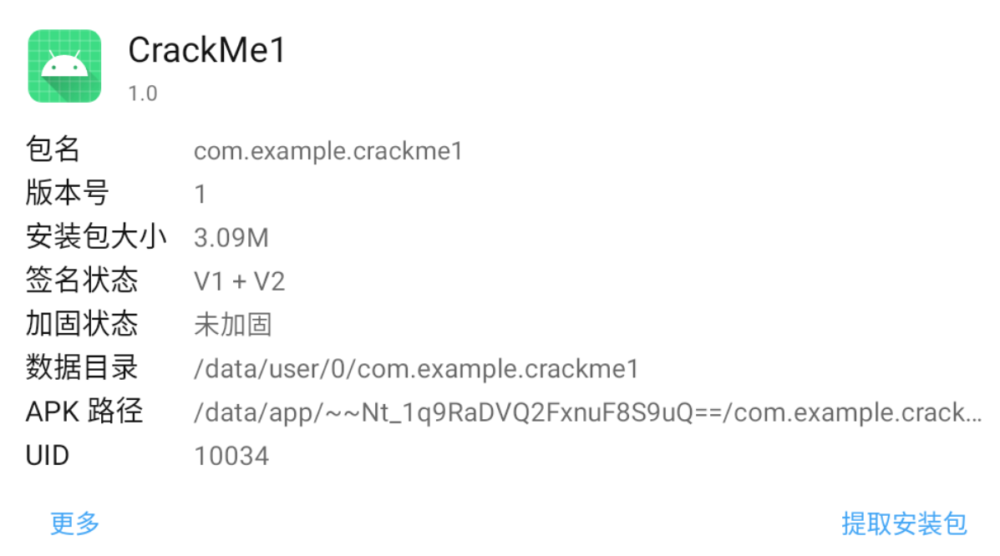
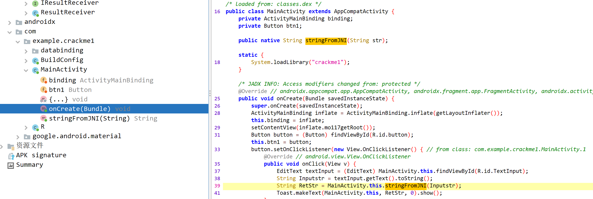
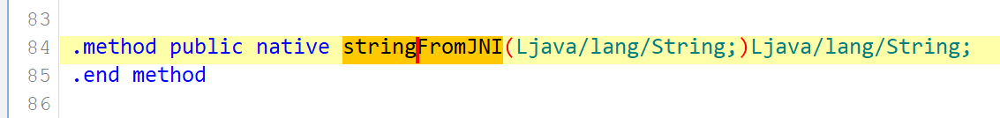
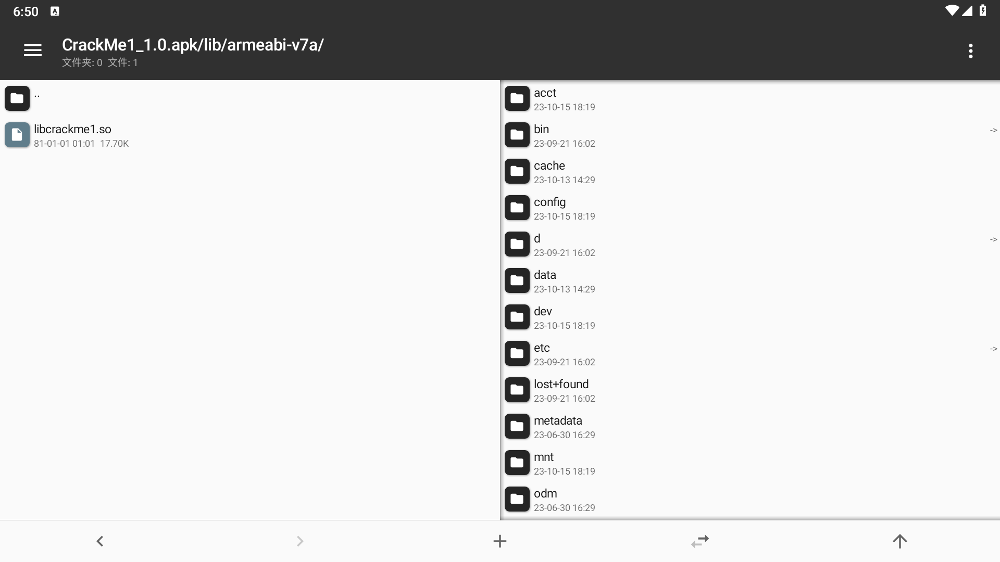
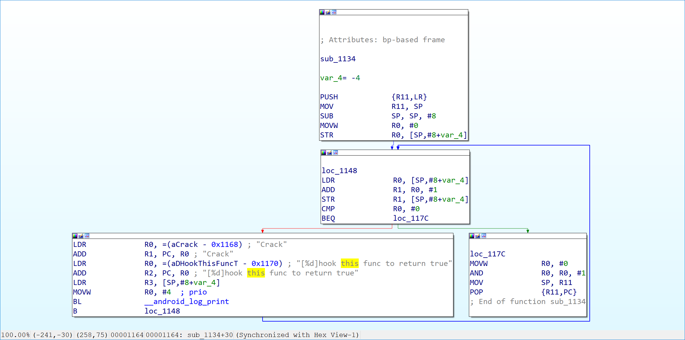
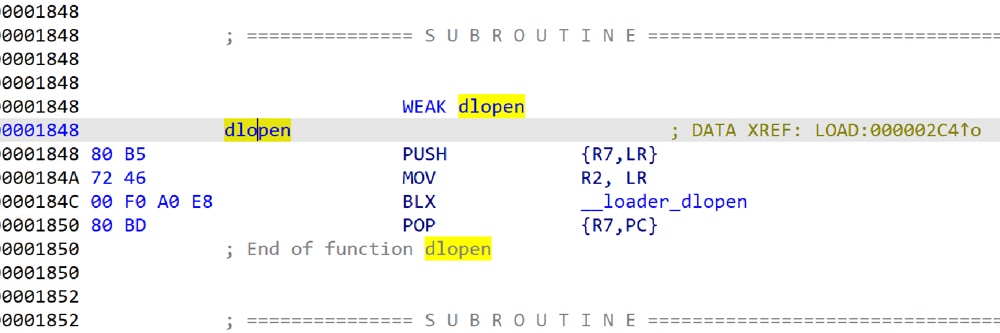
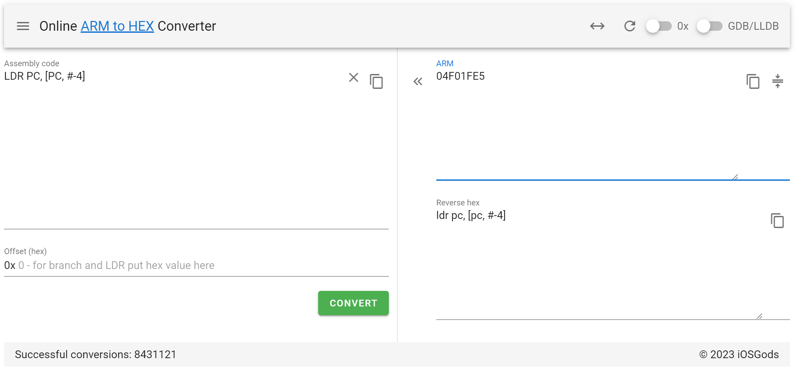
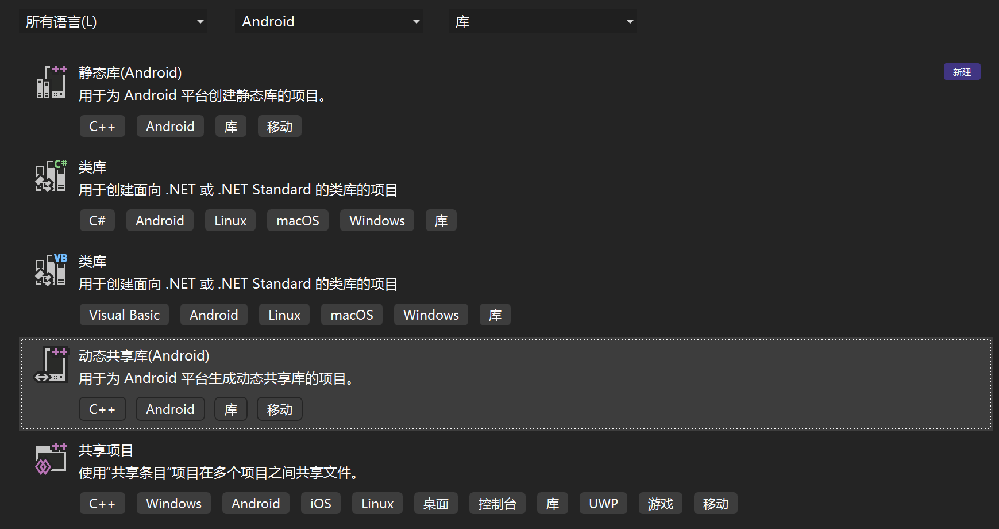
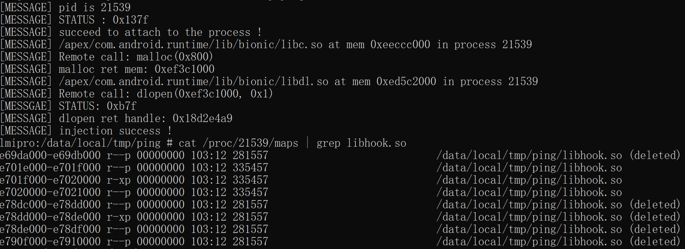

# 第二次作业


## 目录
* [1. apk分析](#1. apk分析)
* [2. ptrace注入](#2. ptrace注入)
* [3. inline hook替换proc_0x1134](#3. inline hook替换proc_0x1134)


使用的工具

| name           | version       |
| -------------- | ------------- |
| MT manager     | v2.14.0       |
| Leidian player | v9.0.60(9)    |
| MuMu player    | v3.5.21(2169) |
| jadx           | v1.4.4        |
| jeb            | v4.20         |
| adb            | v10.0.19045   |
| VMOS Pro       | v2.9.8        |
| MinGW64	 | v4.9.2	 |


## 1. apk分析

​	用MT管理器查看程序信息，包名为`com.example.crackme1`，未加固。



​	反编译AndroidManifest.xml，看到`android.intent.category.LAUNCHER`，说明该activity是主界面，即`MainActivity`为程序入口


​	向jadx导入crackme1.apk，找到`MainActivity`类，通过查看反编译JAVA代码，可以看到`button`类有一个`serOnClickListener`()方法。接着往下看，可以判断`btn1`是一个确认按钮，`onClick()`函数是一个槽函数，当按钮接收到点击事件，读取`EditText`中的内容并转为String类型的`Inputstr`，再由`stringFromJNI()`函数处理Inputstr，并返回`RetStr`，RetStr字符串会在`Toast.makeText()`中打印，推测这个就是窗口底下的`right`和`wrong` 



​	Inputstr是输入文本，RetStr是输出提示，故`stringFromJNI()`是一个验证输入文本的函数。用JEB远程附加在com.example.crackme1上进行调试，在`invoke-virtual`调用stringFromJNI处下断点，验证这里确实返回了“wrong”到v2中，其中v0是输入的文本，为123。


​	查看Smali代码，发现stringFromJNI只有一个public声明，说明是调用的动态链接库。再结合`System.loadLibrary("crackme1")`，推测stringFromJNI来自这里。

​	

​	再用MT管理器打开apk，在`crackme1/lib/armeabi-v7a`找到`libcrackme1.so`，对应了前面的库加载。后面以它为主要分析目标。



​		将libcrakme1.so导入IDA，反编译代码，找到判断逻辑，发现`sub_F50()`实际是一个随机函数，故`strncmp()`的结果完全是随机的，而`sub_1134()`在反编译代码中恒返回0，考虑应该通过注入inlinehook将其改为1


​	查看原汇编指令，这是一个永远执行右边分支的函数，且右边分支一定返回0。左边分支调用`__android_log_print`，打印的内容是提示我们对该函数进行hook，使其永远返回true，记其为`proc_0x1134`，关于libcrackme.so基地址的地址偏移也为0x1134。

## 2. ptrace注入

​	以下是听视频课程时关于ptrace注入的笔记，后面编写注入器injector会多次调用到。

```
ptrace(PTRACE_ATTACH, pid, NULL, NULL)附加到远程进程

父进程用waitpid()判断子进程是否暂停
修改远程进程前，需要先读取和保存所有寄存器的值，detach时需要恢复到原有环境

ptrace(PTRACE_GETREGS, pid, NULL, regs)读取寄存器
ptrace(PTRACE_SETREGS, pid, NULL, regs)写入寄存器
ptrace(PTRACE_PEEKTEXT, pid, addr, pBuf)读取内存（单位为word）
ptrace(PTRACE_POKETEXT, pid, addr, data)写入内存（单位为word）
ptrace(PTRACE_DETACH, pid, NULL, 0)脱离远程进程
```

​	ptrace注入crackme1的思路是，①ptrace_attach附加到进程 --> ②远程调用malloc函数分配内存 --> ③ptrace_poketext将libhook.so真实路径写入进程内存 --> ④远程调用dlopen加载libhook,so文件 --> ⑤ptrace_cont恢复进程，ptrace_detach脱离进程


​	`malloc()`函数在`libc.so`文件中，`dlopen()`函数在`libdl.so`文件中，查找com.example.crackme1的maps，找到了这两个库的路径，用adb pull下来，在IDA中查看两个函数的地址偏移。分别为`0x0002D584`和`0x0001848`，但是有问题的是左边的指令编码有得是16 bit有得是32 bit节，这应该ARM架构的指令集模式有关。



​	


>   ARM 指令集相对复杂，支持更多的寻址模式和指令类型，以及更多的寄存器，通常是 32 位长。
>
>   Thumb 指令集是一种精简指令集，支持较少的寻址模式和指令类型，以及较少的寄存器，通常是 16 位长
>
>   当在ARM体系结构中混合使用ARM指令集和Thumb指令集时，通常函数的地址的最低位用于指示所使用的指令集，如果函数的地址的LSB为0，那么它将以ARM指令集执行。如果LSB为1，它将以Thumb指令集执行。

​	在实机中使用busybox的指令readelf查看偏移地址，从中可以看到dlopen()的偏移地址为`0x1849`，malloc()的偏移地址为`0x2d685`，这说明该Armv7a处理器以`Thumb`模式运行。


​	在开始ptrace注入代码之前，还需要搞清楚远程调用函数时，对16个寄存器应该如何操作。

>   regs.uregs[16]是用于存储CPU寄存器的数组
>
>   R0 ~ R3用于存储函数的形参，其中R0用于存储返回值
>
>   R4~R11用于存储局部变量和临时数据
>
>   R12用于存储临时数据
>
>   R13是SP寄存器，是堆栈的指针
>
>   R14是LR寄存器，存储函数调用的返回地址
>
>   R15是PC寄存器，存储指令地址
>
>   R16是CPSR寄存器，第5位用于**标示Thumb模式**！

据此我可以编写远程调用`malloc`和`dlopen`的函数（以下以malloc函数为例，详情可见源代码）

```cpp
void *mall0c(pid_t pid, size_t len)
{
    /* 
        malloc 1个参数，压入R0中
        返回值在R0中
        LR寄存器存返回地址
        手动传参后，修改PC寄存器为目标函数地址，修改LR寄存器为0
        函数返回时触发异常，获取返回值
    */
    int status;
    struct user_regs pushed_regs;
    struct user_regs regs;
    ul malloc_offset;
    void *remote_lib_base;
    void *malloc_addr;
    malloc_offset = 0x2d685; 					           // 用IDA读取elf文件libc.so观察得出
    // 计算malloc在远程进程中的地址
    remote_lib_base = get_lib_base(pid, libc_dir);		   // 获取libc.so基地址
    malloc_addr = remote_lib_base + malloc_offset;		   // 计算malloc地址
    dlerror();
    if( ptrace(PTRACE_GETREGS, pid, NULL, (void *)&pushed_regs) < 0 )
    {
        perror("[WARNING] failed to push remote regs \n");
    } 
    memcpy(&regs, &pushed_regs, sizeof(struct user_regs)); // 寄存器压栈
    regs.uregs[13] -= 0x50; 							   // 堆栈压80位，主要就是存放寄存器
    regs.uregs[14] = 0; 								   // LR寄存器
    regs.uregs[15] = ((ul)malloc_addr & 0xFFFFFFFE);       // PC寄存器，地址最低位决定处理器模式
    regs.uregs[0] = (ul)len; 							   // R0
    printf("[MESSAGE] Remote call: malloc(0x%lx)\n", (ul)len);
//	如果PSR寄存器有变化，则需要修改第5位
//    if ((ul)malloc_addr & 0x1) // 设置PSR寄存器，第5位为1表Thumb模式，为0表ARM模式
//        regs.uregs[16] = regs.uregs[16] | 0x20;
//    else
//        regs.uregs[16] = regs.uregs[16] & 0xFFFFFFDF;
    if(ptrace(PTRACE_SETREGS, pid, NULL, (void *)&regs) < 0 || ptrace(PTRACE_CONT, pid, NULL, NULL) < 0 )
    {
        perror("[WARNING] call malloc() failed !\n");
        return NULL;
    }
    waitpid(pid, &status, WUNTRACED);
    while (status != 0xb7f) 				// 过滤因返回地址为0触发异常而返回的错误码: 0xb7f
    {
        ptrace(PTRACE_CONT, pid, NULL, NULL);
        waitpid(pid, &status, WUNTRACED);
    }
    ptrace(PTRACE_GETREGS, pid, NULL, (void *)&regs);
    void *ret = (void *)regs.uregs[0];
    // 寄存器出栈
    ptrace(PTRACE_SETREGS, pid, NULL, (void *)&pushed_regs);
    printf("[MESSAGE] malloc ret mem: 0x%lx\n", (ul)ret);
    return ret;
}
```


以下是ptrace注入整体框架代码，共分为4步：

1.   获取进程pid
2.   附加到进程com.example.crackme1
3.   远程调用malloc分配内存，远程调用dlopen加载libhook.so
4.   解除附加

```cpp
 ///***** 1. 获取进程pid *****
    sprintf(process, "pidof %s", argv[1]); // 用shell指令得到pid
    if((fp = popen(process, "r")) == NULL )
    {
        printf("[WARNING] process not found !\n");
        return -1;
    }
    fread(pbuffer, 1, 256, fp);
    sscanf(pbuffer, "%d", &pid);
    printf("[MESSAGE] pid is %d\n", pid);
    pclose(fp);

///***** 2. 附加到进程 *****
    const char *lib_dir = argv[2];
    if(ptrace(PTRACE_ATTACH, pid, NULL, NULL) < 0)
    {
        perror("[WARNING] failed to attach to the process !\n");
        return -1;
    }
    int status;
    waitpid(pid, &status, 0);
    printf("[MESSAGE] STATUS : 0x%x\n", status); // 0x137f
    printf("[MESSAGE] succeed to attach to the process !\n");

///***** 3. 远程函数调用 *****
    // 远程调用malloc，为hook分配内存，写入lib文件路径
    void *buffer = mall0c(pid, 0x800);
    if( buffer == NULL )
    {
        perror("[WARNING] malloc failed !\n");
        printf("\n getchar() debugging ......\n");
        getchar();
        ptrace(PTRACE_CONT, pid, NULL, NULL);
        ptrace(PTRACE_DETACH, pid, NULL, NULL);
        return -1;
    }
    // 将hook lib写入进程内存
    ptrace_poketext(pid, strlen(lib_dir) + 1, (void *)lib_dir, buffer);
    // 将lib文件加载到进程
    if( d1open(pid, buffer, RTLD_LAZY) == NULL )
    {
        perror("[WARNING] load lib to process failed !\n");
        return -1;
    }

///***** 4. 解除附加 *****
    printf("[MESSAGE] injection success !\n");
    ptrace(PTRACE_CONT, pid, NULL, NULL);
    ptrace(PTRACE_DETACH, pid, NULL, NULL);

```


如何编译使用了ptrace库的injector.c？只需要用NDK内的`armv7a-linux-androideabi33-clang`，注意androideabi版本和android版本对应表在[Android API Levels](https://apilevels.com/)中，我最终实现注入的真机是Android13版本，故使用level 33。

​	进入实际操作环节，我尝试了LeiDian9 、MuMu12、MuMu6、VMOS Pro等多款不同操作系统上的安卓虚拟机，但是均出现一些无法解决的难题，困难之下只好借来能root的小米手机，用真实机进行测试。

>   LeiDian9、MuMu12等模拟器都有一个共同问题，即ptrace_attach附加后com.example.crackme1就会自动闪退，无法进行正常注入
>
>   VMOS Pro模拟器则是另外一个问题，即在com.example.crackme1的maps中没有找到libdl.so库，无法按照我的思路进行远程dlopen函数调用

​		下图为真实机测试过程，运行./injector进行注入，可以在c`at /proc/21539/maps | grep libhook.so`后的列表中找到注入的库。

​	


## 3. inline hook替换proc_0x1134

​	接上面apk分析中的内容，通过`inline hook`的方式，在`proc_0x1134`的原位置调用`proc_hook`函数，使其恒返回1，从而使得`stringFromJNI`恒返回right。

​	已知`proc_hook`函数的地址，需要实现插入偏移地址0x1134处的inline hook指令代码。下两张图是两种hook指令示例：




​	这里**直接将proc_hook的地址插入到PC寄存器**，可以实现强行跳转，注意**此时的堆栈中保存的返回地址仍然是调用proc_0x1134前保存的地址**，故可以在proc_hook执行结束后直接回到调用proc_0x1134前的位置，即完成了inline hook。

```
注意ARM状态下，PC寄存器的值为当前指令地址+8字节

0x1134 	LDR R0, [PC]		00 00 9F E5
0x1138 	MOV PC, R0			00 F0 A0 E1
0x1142 	proc_hook			

或者

0x1134  LDR PC, [PC,#-4]	04 F0 1F E5
0x1138  proc_hook
```

​	用Visual Studio 模版创建一个Android平台动态共享库项目，设计hook函数，**核心思想**就是向内存中写入hook指令，**让proc_hook替代proc_0x1134执行**。



```cpp

int proc_hook()
{
    LOGI("Succeed to hook, return 1 all the time !");
    return 1;
}

void hook()
{
    unsigned char hookCommand[12] = { 0x00, 0x00, 0x9F, 0xE5, 0x00, 0xF0, 0xA0, 0xE1 };
    void* lib_base = NULL;                  // 用于存放libhook.so的基地址
    unsigned long offset_0x1134 = 0x1134;   // 目标函数偏移地址
    void* addr_0x1134;                      // 目标函数地址
    FILE* fp;
    // 遍历/proc/com.example.crackme1/maps，查找libhook.so地址
    fp = fopen("/proc/self/maps", "rt");
    do{
        fgets(line, 1024, fp);
        if (strstr(line, "libcrackme1.so") != NULL){
            sscanf(line, "%lx", (ul*)&lib_base);
            LOGI("libcrackme1.so at 0x%lx", (ul)lib_base);
            // 计算目标函数真实地址
            addr_0x1134 = (void*)((ul)lib_base + offset_0x1134);
            LOGI("proc_0x1134 at 0x%lx", (ul)addr_0x1134);
            LOGI("proc_hook at 0x%lx", (ul)hookProc);
            // 修改段保护
            mprotect(lib_base, 0x2000, PROT_READ | PROT_WRITE | PROT_EXEC);
            // 补充跳转地址为hookProc
            *(ul*)(hookCommand + 8) = (unsigned long)proc_hook;
            // 写入hook指令
            memcpy(addr_0x1134, (void*)hookCommand, 12);
            return;
        }
    } while (strlen(line));
		// 没找到 libhook.so
        LOGW("libcrackme1.so not found !");
        return;
}
```

​	hook函数设计好了，但是如何执行？非常感谢知乎大佬的一篇帖子: [constructor属性函数在动态库加载中的执行顺序](https://zhuanlan.zhihu.com/p/108274829)

>   用constructor属性指定的函数，会在目标文件加载的时候自动执行，发生在main函数执行以前，常用来隐形得做一些初始化工作。
>
>   函数声明：
>
>   void __init() __attribute__((constructor));
>
>   也可以是静态函数：
>
>   static void __init() __attribute__((constructor));

​	参照上述先验知识，只需要在libhooc.so中加入以下代码逻辑，就可以实现hook注入

```cpp
void init() __attribute__((constructor));
void init()
{
    //  直接调用函数hook()
    hook();
    return;
}
```

​	

​	实机hook：



​		注入之后，点击CrackMe1窗口中的确认，即使什么都不填，也能返回`right`！


