# 期中作业


[TOC]

*   分析环境

    | OS                                  | Arch    |
    | ----------------------------------- | ------- |
    | Microsoft Windows 10                | Intel64 |
    | Android 6.0 (Linux kernel v3.10.0+) | armv7l  |
    
*   使用工具

    | Tools                  | Version          |
    | ---------------------- | ---------------- |
    | Detect It Easy         | v3.01            |
    | x64dbg                 | Jun 15 2022      |
    | ScyllaHide Plugin      | v1.4.750         |
    | IDA Pro                | v7.5 SP3         |
    | Android Studio Giraffe | 2022.3.1 Patch 2 |
    | Android Debug Bridge   | v1.0.41          |
    | UPX                    | v4.1.0 & v3.95   |
    | OllyDumpEx             | v1.84            |


## 1 PC端作业

### 1.1 protector分析与反调试绕过

​		将`crackme2.exe`拖入`DIE`工具，确定文件类型`PE64`、有壳`VMProtect`、入口点`0x140340cd3`（肯定不是OEP）


​	尝试动态调试，使用`x64dbg`调试，`Alt+F9`运行到入口点`0x140340cd3`，“先push再call”属于典型vmp特征，这里说明程序入口点被加壳，需要后续动态分析定位原始入口点`OEP`。


​	单击`F9`继续运行，弹出提示`检测到调试器`，说明程序存在`反调试`机制，不能直接进行动态调试寻找OEP。

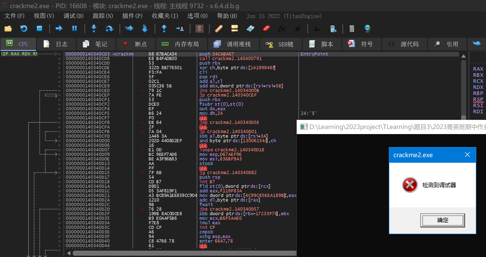

​	这里使用插件`ScyllaHide_x64dbg`进行绕过，通过inline Hook一些库函数隐藏调试器，再次启动调试发现不再出现“检测到调试器”`MessageBox`。

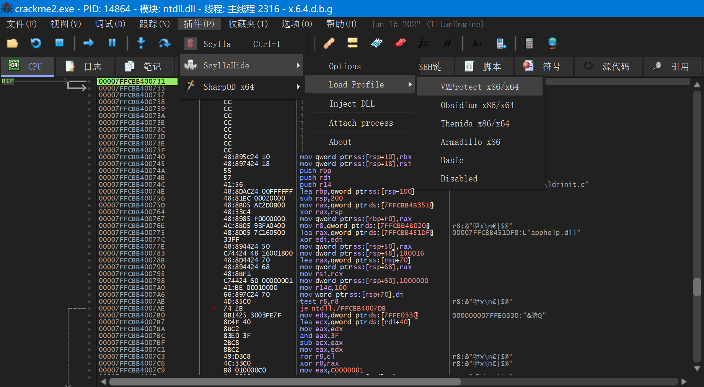

### 1.2 动态调试寻找原始入口点

​	回到寻找OEP的目标上来，在假入口点`F9`运行后，会分别在3处`nop`停下来，且在最后一处`nop`后调用了输入函数。（这里3处nop之间都是反调试的函数）

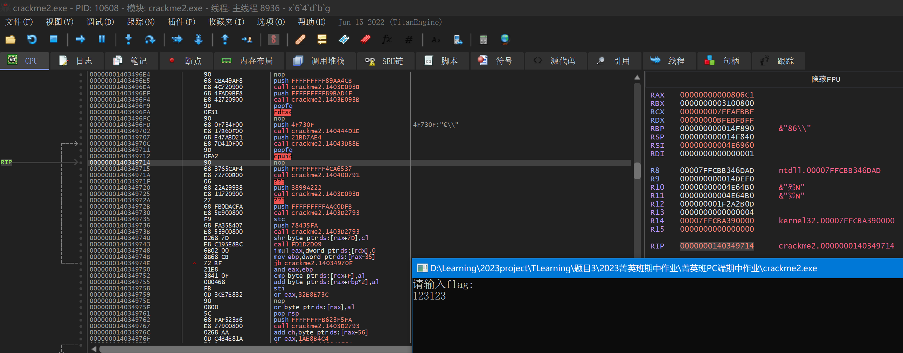

​	输入`123123`后，先不急着回车，观察`RIP`地址位置，发现位于`NtReadFile`库函数段内，这明显是输入flag的函数api，进一步我们可以根据`ESP`定律，通过栈上的函数调用地址找到OEP。

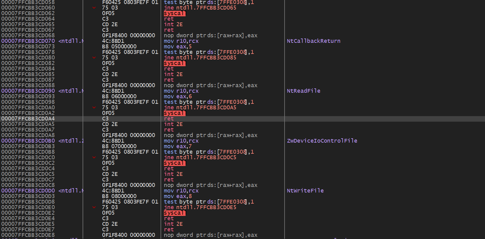

​		如下图，我们获得调用顺序： `ntdll.0x00007FFCBB35B44D ret` ->`kernelbase.0x00007FFCBBA45783 call NtReadFile`->`crackme2.0x140019635 call ReadFile` ->（此处省略近10次call，因为找到ReadFile其实就基本找到了入口点），我们对找到的整个调用链上的call语句下断点。


​	重新启动程序，可以找到`请输入flag:`、`%s`等字符串在内存中的位置，说明已经成功找到程序入口后的flag输入部分。


​	由于本程序被混淆处理得十分破碎，故只能在动态分析中猜测关键程序段的作用。输入字符串`123123`在函数`0x140011750`附近逐个取出`132123`的字符进行判断，这里猜测是执行类似`strlen()`的函数，其中`\n`不会算作字符串长度。（当然也可能是执行了类似`strcpy()的函数`）

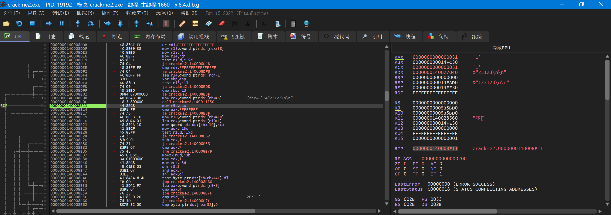

​	单步执行上述断点的函数后，`RIP`指向了一段有着非常多`xmm`寄存器操作的地方（这很难不让人想起第一次作业判断分支前面的大量xmm寄存器），且继续往下翻不远处有一个`Slepp()`调用，猜测这是为了在显示flag是否正确后延迟程序终止——故**flag判断一定在他们两者之间**！

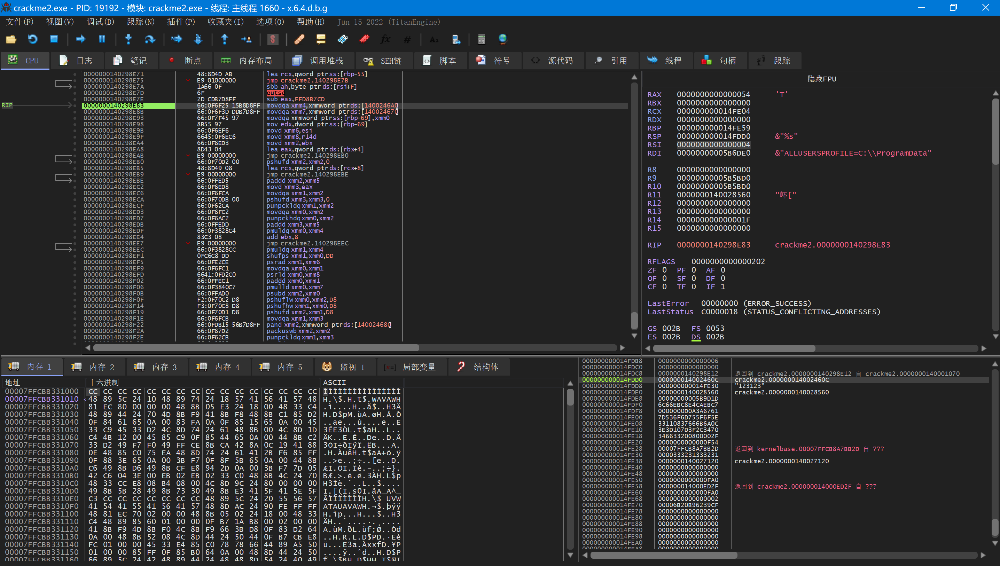

​	程序中有很多`cmp ebx, 20` 、`cmp ebx, 21`的判断回跳，为加快调试效率，对于这类实际上回往回跳转循环执行的，且从内存中也不能明显看出其逻辑的循环，直接对后面设断点并`F9`即可。

​	在跳过了大量xmm寄存器处理后，发现` [rbp-59] = 0x14FE00`处有一处很长的字符串`jZiBUViF0WUYwISp4qjx5YwucMNGpb4g`，且在继续单步运行后，出现非常明显的字符串比较判断分支：

```assembly
sub edx, ecx
jne notequal
inc rax
cmp r11w, di
test ecx, ecx
...
```

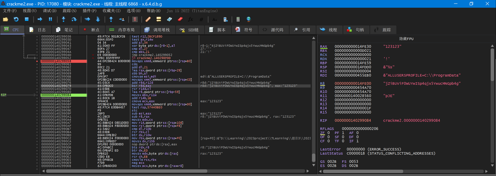


​	可以初步判断此字符串为flag，在`crackme2.exe`中经过验证确实为flag


### 1.3 静态分析总结

​	用IDA反编译x64dbg中找到的疑似字符串比较代码，虽然已经面目全非，但还是基本能看出`RCX`存放输入字符串的某一位，`v39`存放flag字符串相应位的地址，`v48`存放输入字符串的首地址的指针(形如`&"123123"`)，`v50`存放flag字符串的首地址，故很容易看出这里是直接取flag进行比较的。


​	综上，本题最主要的难点在于绕过反调试，以及如何通过手动debug在复杂混乱的程序中找到关键的代码段，这里我通过`ReadFile`、`%s`、`&"123123"`等许多可以在x64dbg监视窗口上直接阅读到的信息，找到了程序真实入口，并获取到了flag。


## 2 移动端作业

### 2.1 packer分析与脱壳尝试

​	将`CrackMe2`拖入`DIE`工具，有`upx3.95`压缩加壳，`arm32`指令集架构，入口点`0x0002121c`

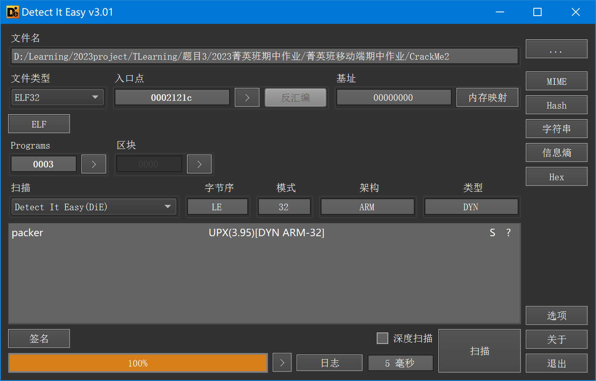

​	直接工具脱壳尝试，`upx -d CrackMe2`，居然提示`not packed by UPX`？说明做了反脱壳保护。“知己知彼，百战不殆”，[**UPX防脱壳机脱壳、去除特征码、添加花指令小探**](https://www.52pojie.cn/thread-326995-1-1.html)有许多UPX防脱壳的策略，包括①修改区段名；②改标识；③去掉UPX特征码；④添加花指令.....等方法。

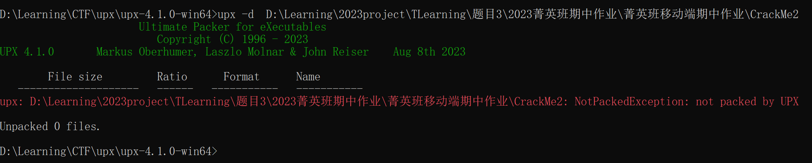

​	通过`DIE`分析，并没有找到很明显的可以“反反脱壳”的地方，因为这个程序总共就3个程序段，连一个区也没有看到，且如果是`UPX!`标识被修改，我更是不可能遍历出被修改的地址。

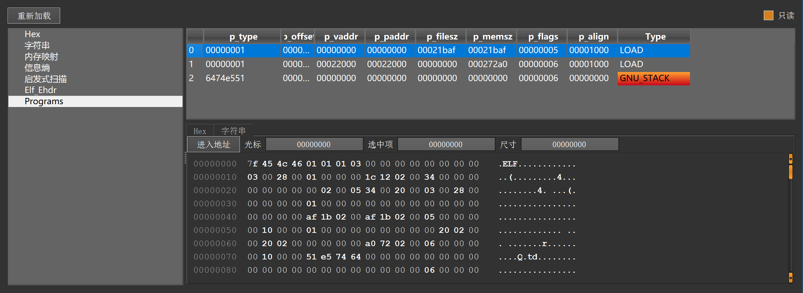


### 2.2 动态调试与绕过反调试

​	既然不能直接工具脱壳，我们采取Plan B：动态调试进入OEP后，upx已经解压缩，利用`ESP`定理从libc库返回到程序，dump内存

​	将CrackMe2`adb push`到`Android Studio VAD`设备中，同时将`IDA Pro`的`android_server`传入虚拟机，用`adb forward tcp:23946 tcp:23946`开启流量转发，IDA便可以附加到VAD的进程上进行调试。

​	但如下图所示，在`android_server`端口监听开启时，`./CrackMe2`一运行就会提示`undebug`，这是典型的检测端口反调试，但可以通过先运行`./CrackMe2`再开启端口监听解决。（如下左图最后一次运行CrackMe2时成功打印`Input Your Answer`）


​	但是后续又发现第二个反调试机制，即在输入数据返回原程序后，会先进行一次`debugger`判断，并强制退出进程。（如下图在输入了`123123`后还是触发`undebug`）


​	解决方法是用IDA Pro附加进程后，通过栈中的地址回调，在返回到debugger判断函数时就立即`dump`内存，然后就不用管这个有壳的程序了，直接静态分析我们dump下来的程序。


​	输入123123后，观察栈的回调地址，可以逐步进行断点：

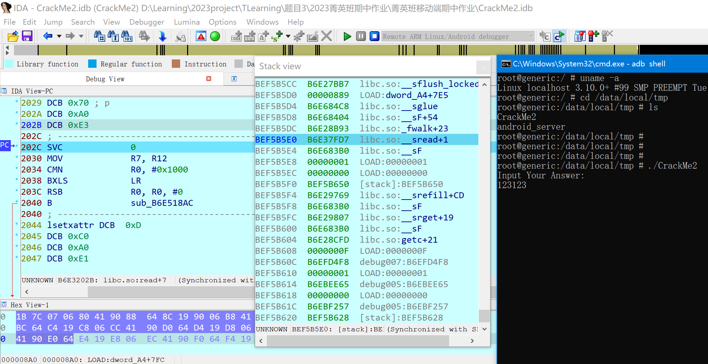

​	`__sread`->`__srefill`->`_srget`->`getc`->`debug005`最后返回`debug005`程序段，且尚未被undebug强制终止。

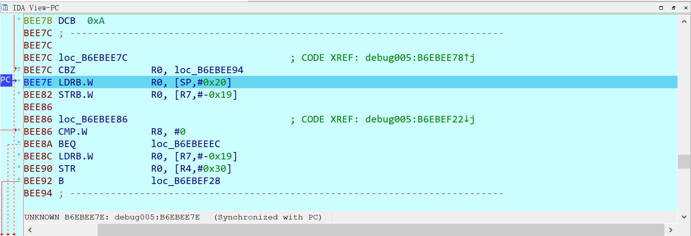

​	用`OllyDumpEx`一键dump内存，保存为`crackme_dump.so`，由于该文件有些损坏，不能直接运行调试，接下来的任务交给静态分析。

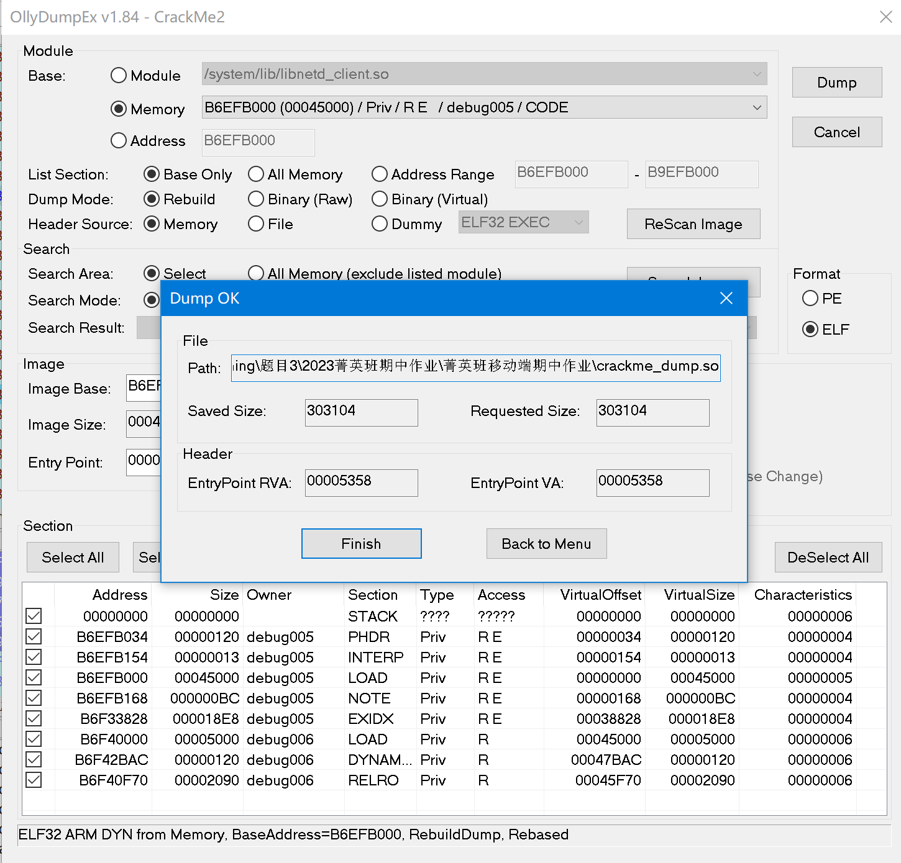

### 2.3 静态分析总结

​		 IDA Pro打开`crackme_dump.so`，很容易找到`main`位于`0x6dF8`

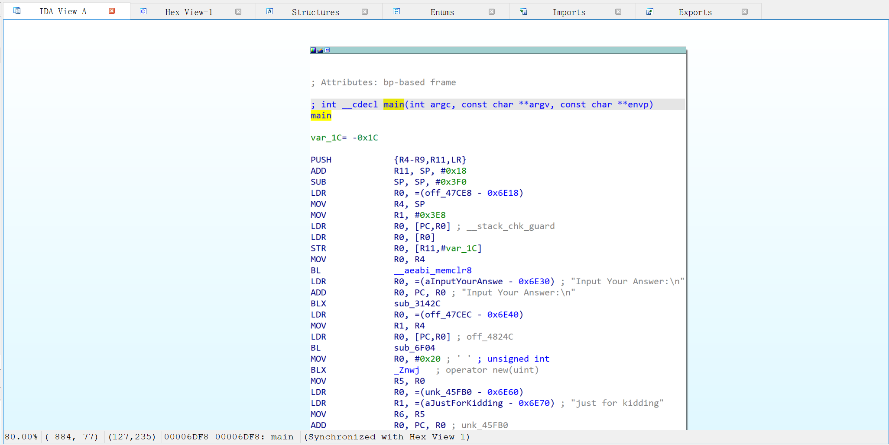

​	常量声明区域，有很多可以解释上面反调试操作的字符串，检测栈溢出攻击的`__stack_chk_guard`、检测端口监听的`cat /proc/net/tcp | grep :5D8A`和检测调试器`/proc/%d/status`。其中有很可疑的`Base64`格式的编码：`DMD2vxKYDLvezuriqND2DhP3BJfdtuWWrxe9pq==`但是用python脚本尝试，并不能直接decode()，说明**该编码已被部分或全部替换**或者**标准Base64索引表被替换**。


>   Base64编码规则	
>
>   将字符串转换成二进制序列，每6个二进制位为一组，每6位组成一个新的字节，高位补00
>
>   编码表顺序：
>
>   ABCDEFGHIJKLMNOPQRSTUVWXYZ
>
>   abcdefghijklmnopqrstuvwxyz
>
>   0123456789+/

​	在全局常量表上，出现了类似编码表的字符串，查看它们的调用位置，可能能找到编码的地址。

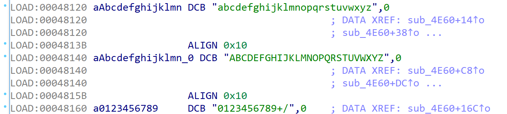

​	调用这3个字符串的函数是`sub_4E60`、`sub_8998`，其中`sub_8998`可能是UPX用于初始化加密字符串的。`sub_4E60`可能是跟base64编码有关，但是对于编码表的顺序值得注意，因为小写字母是始终排在前面的！


​	大胆尝试，编写一个自定义base64编码索引的脚本，尝试加解密文本。(其实这个编码索引的改变只是改变了字母的大小写而已)

```python
import base64
# 标准索引
standard_charset = "ABCDEFGHIJKLMNOPQRSTUVWXYZabcdefghijklmnopqrstuvwxyz0123456789+/"
# 自定义索引
my_charset = "abcdefghijklmnopqrstuvwxyzABCDEFGHIJKLMNOPQRSTUVWXYZ0123456789+/"
# 构建转换
trans = str.maketrans(standard_charset, my_charset)
# 要解码的数据
encoded_data = "DMD2vxKYDLvezuriqND2DhP3BJfdtuWWrxe9pq=="
for i in range(2):
    # 先进行编码转换
    encoded_data = encoded_data.translate(trans)
    print(encoded_data)
    # 再进行正常base64编码
    data = base64.b64decode(encoded_data.encode()).decode()
    print(data)
    encoded_data = data
```

​	第一次进行编码转换和base64解密，发现还是base64`vgvUy2vUDeDHBwvtzwn1CML0Eq==`但是经过检验，发现还是不能用标准base64解密，故再用第二次编码转换和base64解密，最后得到`TencentGameSecurity`，看起来很像flag的样子。


```bash
(base) PS D:\Learning\2023project\TLearning\题目3\2023菁英班期中作业\菁英班移动端期中作业> python .\mybase64.py 
dmd2VXkydlVEZURIQnd2dHp3bjFDTUwwRXE9PQ==
vgvUy2vUDeDHBwvtzwn1CML0Eq==
VGVuY2VudEdhbWVTZWN1cml0eQ==
TencentGameSecurity
```

​	直接找`True Answer`和`Wrong Answer`的调用记录，发现一个判断分支，说明分支上方就是字符串比较的过程。


​	上面的判断逻辑中，`a1`是一个有3个元素的指针数组，结合base64的编码特征，3字节数据会被编为4字节编码，`a1`可能是输入字符串的base64编码。

​	在下面的循环判断中`v32` <- `v26` <- `*a4`肯定与编码的长度有关，`v31 = a4 + 1`，猜测`a4`指针的后面就是flag编码，而`v29 = a1[2]`，猜测这里的`a1[2]`就是输入字符串的base64编码。


​	综上，猜测程序对输入的字符串进行了**两次自定义base64编码索引的编码**，然后与`DMD2vxKYDLvezuriqND2DhP3BJfdtuWWrxe9pq==`比较，所以将该编码进行两次解码，可以得到需要输入的flag`TencentGameSecurity`
