# 第三次作业

[TOC]


*   分析环境

    | OS                   | Arch    |
    | -------------------- | ------- |
    | Microsoft Windows 10 | Intel64 |

*   使用工具

    | Tools                        | Version |
    | ---------------------------- | ------- |
    | Detect It Easy               | v3.01   |
    | DnSpy                        | v6.1.8  |
    | Cheat Engine                 | v7.5    |
    | SharpMonoInjector.gui        | v2.3    |
    | MelonLoader.Installer        | v3.0.8  |
    | Microsoft Visual Studio 2022 |         |


## 1. 静态分析游戏关键逻辑

​	用`Detect It Easy`检查`FlappyBird.exe`，没有任何保护层。再结合视频课程中介绍，该游戏由`Unity-Mono`开发，可以使用`DnSpy`直接进行反编译攻击获取源码。

​	由于`Managed/Assembly-CSharp.dll`通常存放该游戏的关键类数据和关键逻辑，故直接用`DnSpy`对该文件进行反编译：如下图，可以看到`BirdScripts` / `GameControllers` / `PipeCollectorScrpt` 等与游戏内容密切相关的类名。

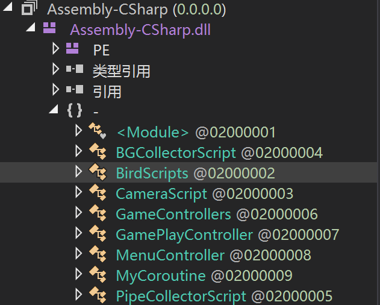

​	查看源码，能推测`BirdScripts`是控制小鸟对象的类，其中有关键属性`bounceSpeed`控制跳跃高度、`forwardSpeed`控制前进速度、`isAlice`控制是否存活和`score`控制当前得分。

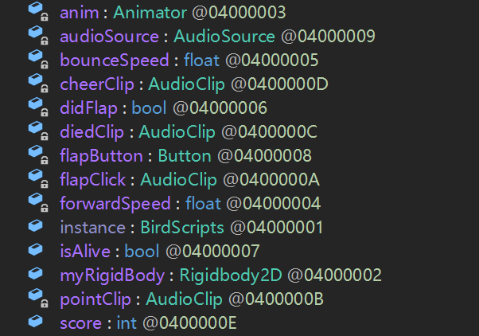

​	而`OnCollisionEnter2D()`方法就明显是小鸟碰撞死亡后显示游戏结束画面的函数，以及小鸟在存活状态下触碰`Flag`后播放胜利庆祝画面表示成功通关；`OnTriggerEnter2D()`方法则在小鸟翻过管道后加分并调用`GamePlayController.instance.setScore()`重新设置画面中的分数。

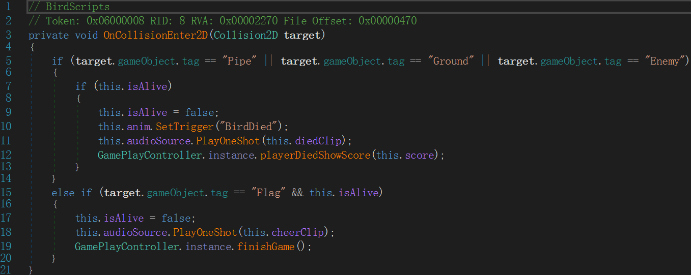

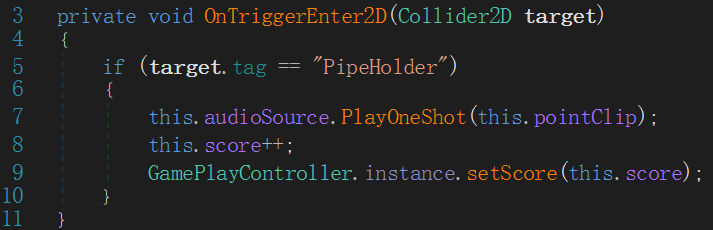

​	`FixedUpdate`则有点特殊，猜测是用于更新游戏画面、游戏音乐，使存活的小鸟保持前进并在响应`Flap`振翅事件后保持y方向上的朝向角度（就是上升时头朝上下降时头复原）。

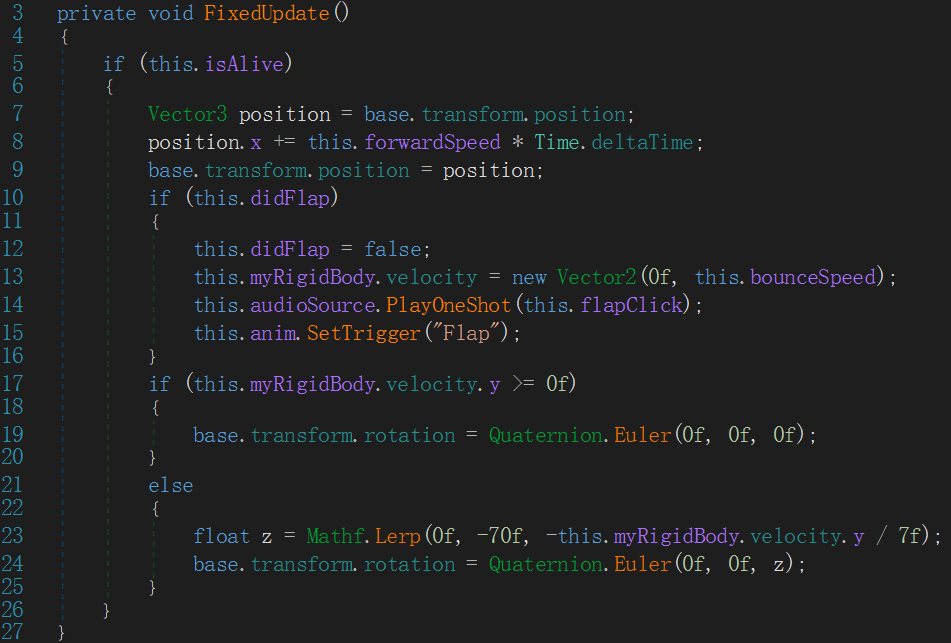


## 2. 游戏破解实战

### 2.1 CheartEngine附加动态修改

#### 2.1.1 直接修改内存	

​	使用`CheatEngine`的`Mono`插件，直接找到`Assembly-CSharp`镜像中`BirdScripts`类的基地址和成员的偏移地址。其中`score`的地址为`0x04e34070+0x64`，直接访问该块内存，修改为`0xFFFF`

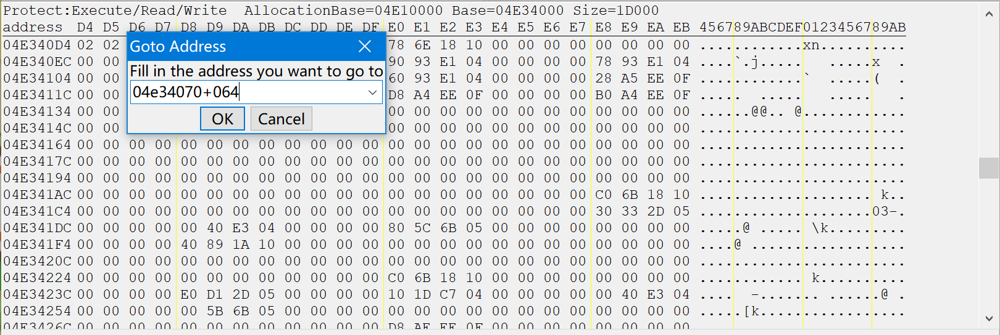


​	在游戏窗口中可以看到，当前的分数已经加上了`0xFFFF`，已经变成了一个巨大的数字


#### 2.1.2 修改加分逻辑

​	尝试修改`OnTriggerEnter2D`的逻辑，原汇编代码如下，其中`inc eax`就是每次翻越管道后的加分逻辑：

```
inc eax
mov [rdi+64],eax
```

​	但我使用工具栏中的`Auto Assembly`功能编写了注入代码，通过跳转到`0x064A0000`进行额外的加分。这样小鸟每次翻越管道都会加0x101（257）分。

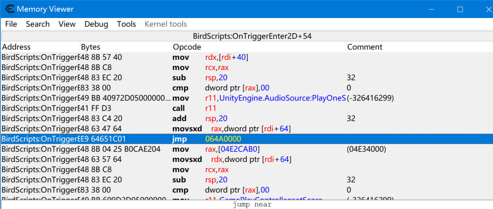

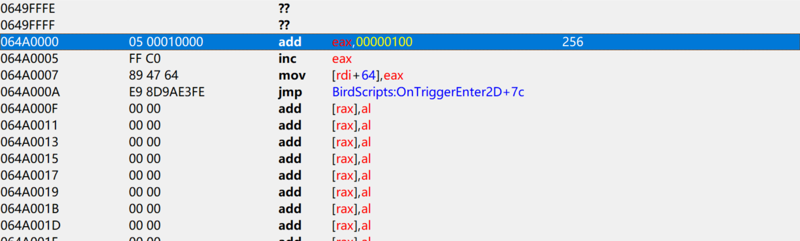


#### 2.1.3 修改碰撞逻辑 

​	尝试修改`OnCollisionEnter2D`的逻辑，关注`get_gameObject`和`get_tag`后的几次比较+跳转：

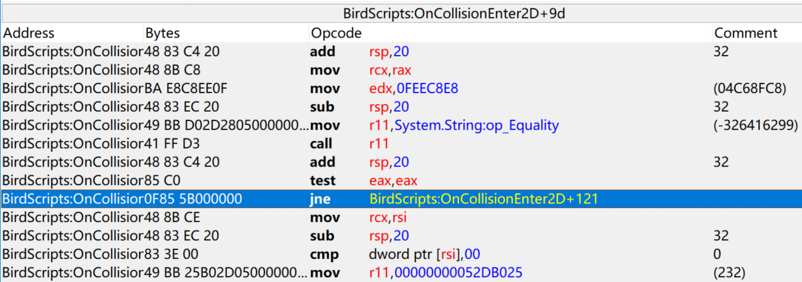


​	在每次调用`op_Equality`之前都会对edx进行赋值，猜测这些地址是待比较的字符串的地址，跳转过去发现确实符合猜测。总结，它们分别是`0xC898`对应`Flag`、`0xC8C0`对应`Enemy`、`0xC8E8`对应`Ground`、`0xCF50`对应`Pipe`。

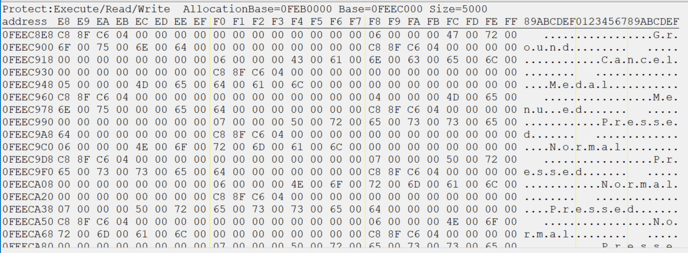

​	知道了上述标签便更容易定位判断逻辑，易知偏移地址为`0x121`处的代码逻辑可能是存活判断，因此把这里的`je`改为`jmp`便可以patch掉死亡逻辑。

>   这里的**[rdi+61]**是典型的结构体属性访问，可以轻松判断这是对this->isAlive属性的访问指令。


​	修改效果如下，小鸟碰撞管道也不会触发游戏结束的事件。

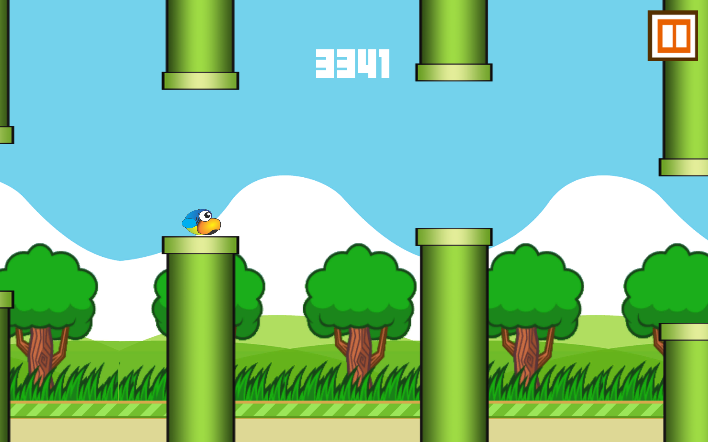

### 2.2 DnSpy重新编译库文件Assembly-CSharp.dll

​	如下图重新编辑Assembly-CSharp.dll中的`BirdScripts`类，将小鸟的碰撞死亡逻辑和触发加分逻辑进行的修改，并加以重新编译。


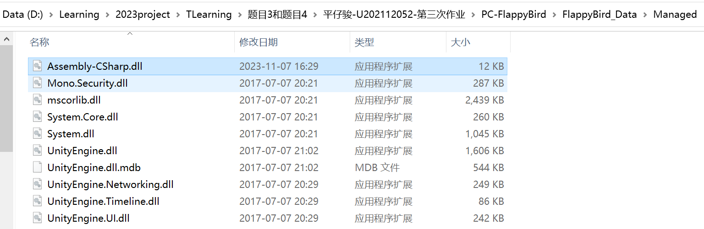	

​	结合上图和下图，可以看出，在替换了新的库文件后，游戏的逻辑已经被我永久修改。（在后面的实验中会将原库文件替换回来，不用担心游戏的完整性。）


### 2.3 SharpMonoInjector实现插件注入

​	使用VS2022编写插件程序集，使用`SharpMonoInjector`获取Mono导出接口注入程序集。

先编写加载器`Loader`，使注入程序集时能够自动加载一个新的游戏对象，并将所编写的`Cheat`类作为组件挂载在游戏对象下面。

```C#
public class Loader
{
    static UnityEngine.GameObject gameObject;
    public static void Load()
    {
        gameObject = new UnityEngine.GameObject();
        gameObject.AddComponent<Cheat>(); // 挂载组件
        UnityEngine.Object.DontDestroyOnLoad(gameObject);
    }
    public static void Unload()
    {
        UnityEngine.Object.Destroy(gameObject);
    }
}
```

​	在编写插件的主要逻辑，先准备好对私有字段、属性、方法的操作函数，主要利用C#的反射特性，使得我们能通过已知的实例对象获取类型（Type）信息，从而获取其私有成员并进行读取、赋值、调用等。

```C#
        // 1. 获取私有字段
        public static T GetPrivateField<T>(this object instance, string fieldname)
        {
            BindingFlags flag = BindingFlags.Instance | BindingFlags.NonPublic;
            Type type = instance.GetType();
            FieldInfo field = type.GetField(fieldname, flag);
            return (T)field.GetValue(instance);
        }
        // 2. 获取私有属性
        public static T GetPrivateProperty<T>(this object instance, string propertyname)
        {
            BindingFlags flag = BindingFlags.Instance | BindingFlags.NonPublic;
            Type type = instance.GetType();
            PropertyInfo field = type.GetProperty(propertyname, flag);
            return (T)field.GetValue(instance, null);
        }
        // 3. 设置私有成员
        public static void SetPrivateField(this object instance, string fieldname, object value)
        {
            BindingFlags flag = BindingFlags.Instance | BindingFlags.NonPublic;
            Type type = instance.GetType();
            FieldInfo field = type.GetField(fieldname, flag);
            field.SetValue(instance, value);
        }
        // 4. 设置私有属性
        public static void SetPrivateProperty(this object instance, string propertyname, object value)
        {
            BindingFlags flag = BindingFlags.Instance | BindingFlags.NonPublic;
            Type type = instance.GetType();
            PropertyInfo field = type.GetProperty(propertyname, flag);
            field.SetValue(instance, value, null);
        }
        // 5. 调用私有方法
        public static T CallPrivateMethod<T>(this object instance, string name, params object[] param)
        {
            BindingFlags flag = BindingFlags.Instance | BindingFlags.NonPublic;
            Type type = instance.GetType();
            MethodInfo method = type.GetMethod(name, flag);
            return (T)method.Invoke(instance, param);
        }
```

​	最后编写GUI端显示和外挂逻辑，利用前面已经设计好的操作方法，使用`FindWithTag()`方法找到控制分数、速度、碰撞逻辑的实例对象，进行逻辑修改实现外挂。注意**每次修改分数并不代表界面中央显示的分数会即时改变**，必须要调用GamePlayController的实例设置新的分数。

```c#
// Q 键修改分数
if (Input.GetKeyDown(KeyCode.Q))
{
    var birdscript = UnityEngine.GameObject.FindWithTag("player").GetComponent<BirdScripts>();
    var gamecontroller = UnityEngine.GameObject.FindWithTag("player").GetComponent<GamePlayController>();
    if (birdscript != null)
    {
        birdscript.score += 114514;
        // 这里需要调用GamePlayController的实例来执行setScore方法，刷新显示的分数
        gamecontroller.setScore(birdscript.score);
    }
}
// W 键修改前进速度(反射机制)
if (Input.GetKeyDown(KeyCode.W))
{
    var birdscript = UnityEngine.GameObject.FindWithTag("player").GetComponent<BirdScripts>();
    Type type = birdscript.GetType();
    var forwardSpeed = OperaterPrivate.GetPrivateField<float>(birdscript, "forwardSpeed");
    Debug.Log("forwardSpeed:" + forwardSpeed);
    forwardSpeed /= 2;
    OperaterPrivate.SetPrivateField(birdscript, "forwardSpeed", forwardSpeed);
}
// E 键修改前进速度(反射机制)
if (Input.GetKeyDown(KeyCode.E))
{
    var birdscript = UnityEngine.GameObject.FindWithTag("player").GetComponent<BirdScripts>();
    Type type = birdscript.GetType();
    var forwardSpeed = OperaterPrivate.GetPrivateField<float>(birdscript, "forwardSpeed");
    Debug.Log("forwardSpeed:" + forwardSpeed);
    forwardSpeed *= 2;
    OperaterPrivate.SetPrivateField(birdscript, "forwardSpeed", forwardSpeed);
}
// R 切换是否无碰撞
if (Input.GetKeyDown(KeyCode.R))
{
    var player = UnityEngine.GameObject.FindWithTag("Player");
    var birdscript = player.GetComponent<BirdScripts>();
    // 切换刚体碰撞逻辑的触发开关状态
    player.GetComponent<Collider2D>().isTrigger = !player.GetComponent<Collider2D>().isTrigger;
}
```

使用`SharpMonoInjector 2.3 `注入构建好的共享库文件，注入游戏进程后可以对游戏内容进行修改。


​	其实类似这种外挂实现也可以用`DnSpy`直接修改游戏的库文件实现（甚至只需要修改`BirdScripts.FixedUpdate`方法就可以实现即时新响应的外挂），最后在`BirdScripts`类中设置GUI的外挂键位提示，便可以实现与SharpMonoInjector注入完全相同的功能。下图是修改示例：

>   直接通过反编译修改源码显然是最轻松的“插件”方式，甚至不再需要**FindWithTag**可以直接访问一些对象

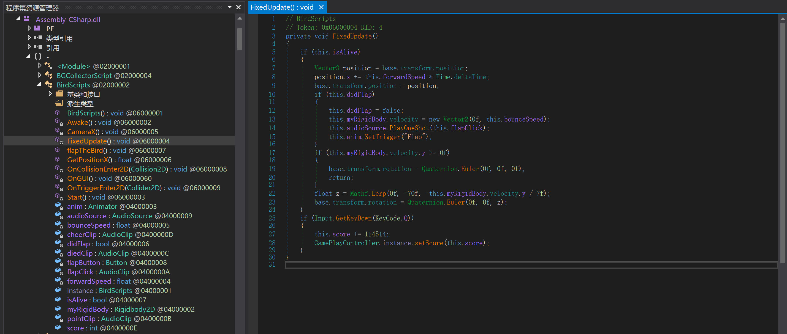


### 2.4 UnityExplorer插件给游戏打mod

​	本次用MelonLoader为FlappyBird安装mod环境，然后加入UnityExplorer插件。通过它的诸多功能对游戏进行内存修改、逻辑修改等。

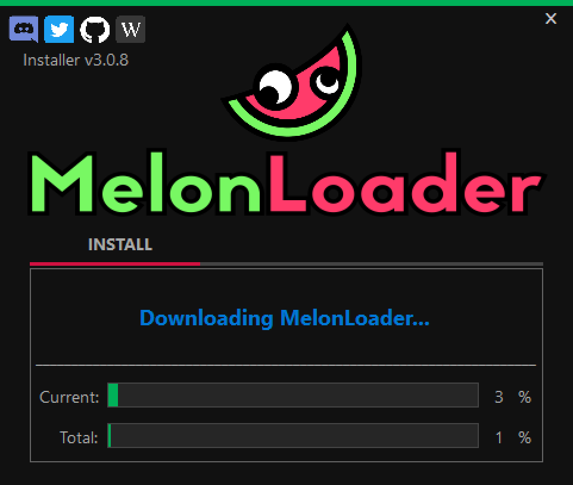


​	根据之前的经验，可以直接使用`Inspector`菜单查看游戏中`BirdScrpts`类的各个成员信息，如果直接修改这里的数值，也可以实现之前已经实现的功能；同样的，也可以使用`Hook`菜单进行一些`JIT`汇编指令的patch，通过改变判断逻辑来实现包括但不限于”无敌“、”穿墙“、”额外加分“等效果。

​                                                       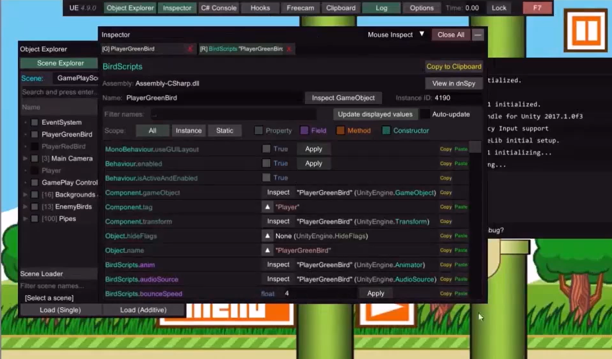	

​	修改分数之类的操作前面已经实现太多了，这里就不赘述，只展示一个关闭刚体触发碰撞后的“穿墙”效果。

