# 第四次作业


[TOC]


*   分析环境

    | OS                                  | Arch                       |
    | ----------------------------------- | -------------------------- |
    | Android 6.0                         | i686（4.0.9-android-x86+） |
    | Android 6.0 (Linux kernel v3.10.0+) | armv7                      |

*   使用工具

    | Tools          | Version                                                 |
    | -------------- | ------------------------------------------------------- |
    | Detect It Easy | v3.01                                                   |
    | MuMu Player6.0 | v2.7.34.0(x86)                                          |
    | MT Manager     | v2.14.0                                                 |
    | DnSpy          | v6.1.8                                                  |
    | IL2CppDumper   | https://github.com/Perfare/Il2CppDumper最近更新于23-3-5 |
    | frida          | v16.1.5                                                 |
    | adb            | v10.0.19045                                             |


## 1. 对游戏APK的分析

​	将安装包push入MuMu12.0，发现安卓版本太高，在apkXML文件中有明确限制。

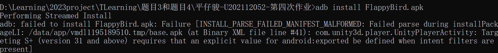

​	故换为MuMu6.0，成功安装游戏，正常运行。


​	用MT管理器提取安装包，包名`com.lordzed.flappyzed`未加固，继续查看其XML文件和lib动态库


​	XML文件没什么有用信息，只能找到主界面`com.unity3d.player.UnityPlayerActivity`这应该是Unity游戏默认的界面名字。


​	lib文件夹里颇有收获，发现`libil2cpp.so`文件，说明该游戏使用`Unity-il2cpp`框架。


​	通过DIE查询，可知是32位的可执行文件，用IDA32打开，但是没有符号信息，无法直接进行静态分析


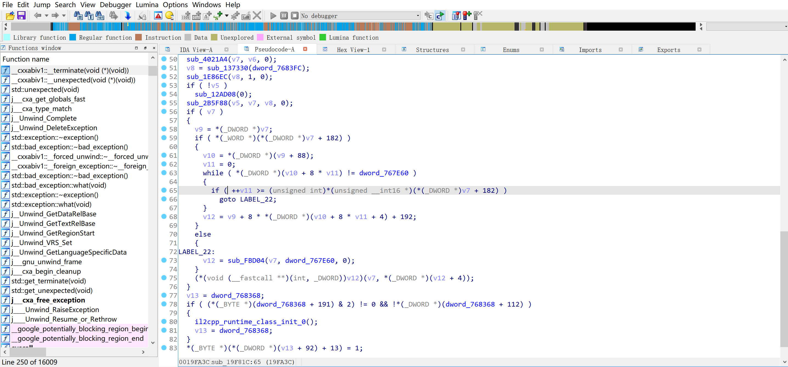

## 2. 基于il2CppDumper分析libil2cpp.so文件	

​	由于`IL2CPP`有静态**符号**信息泄露风险，我们可以使用IL2CPPDumper直接获取类名、方法名以及它们的偏移。根据il2CppDumper的使用教程，解压apk文件并找出想dump的so文件和dat文件。


​	

```bash
D:\Learning\CTF\AndroidReverse\Il2CppDumper\Il2CppDumper.exe global-metadata.dat global-metadata.dat 
Select Mode: 1.Manual 2.Auto 3.Auto(Advanced) 4.Auto(Plus) 5.Auto(Symbol)
4
```

​	转储下来的文件很多，我们逐个分析。先关注`DummyDll`文件夹下的`Assembly-CSharp.dll`，这在windows系统下的Unity游戏中可是很重要的库文件，用`DnSpy`打开

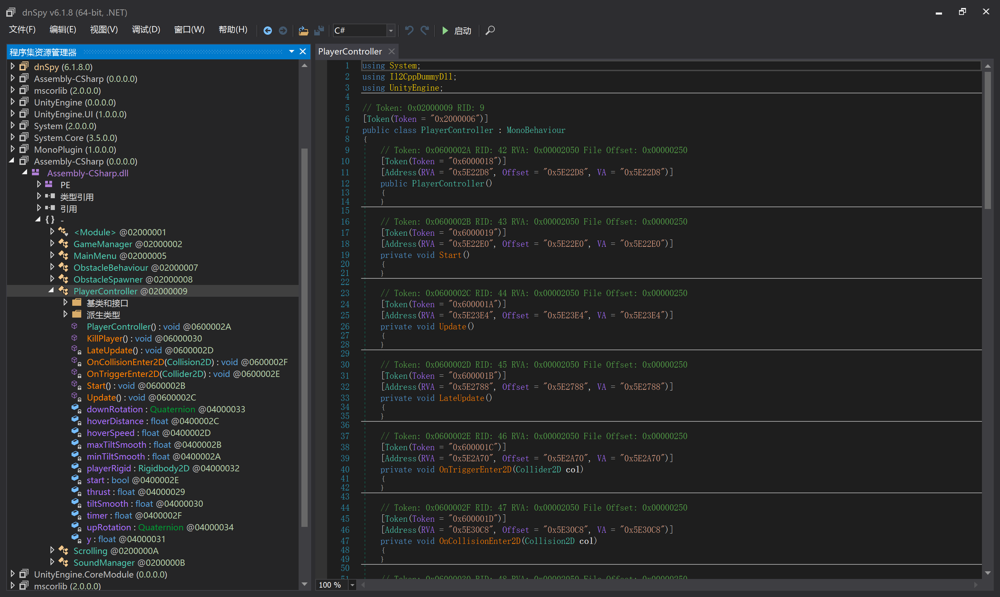

​	打开发现有类名也有方法名，但是里面的实现都是空的，其中`PlayerController`很明显是控制玩家对象的类，`OnCollisionEnter2D`和`OnTriggerEnter2D`很明显是翻越管道的加分逻辑和碰撞反馈的逻辑函数，后面应该会重点研究。

​	通过右侧去掉实现内容的代码信息中，也能观察到每个成员的**偏移地址**，后面可能会用到。

​	

​	`GameManager`类同样需要重点关注，因为里面有许多控制分数和游戏状态的逻辑，如`Update`、`UpdateScore`和`GameState`等方法。


​	接下来使用`IDA32`，结合`IL2CppDumper`仓库中现有的python脚本，恢复`il2cpp.h`中的结构体信息和`script.json`中的符号信息，从而静态分析`libil2cpp.so`文件。

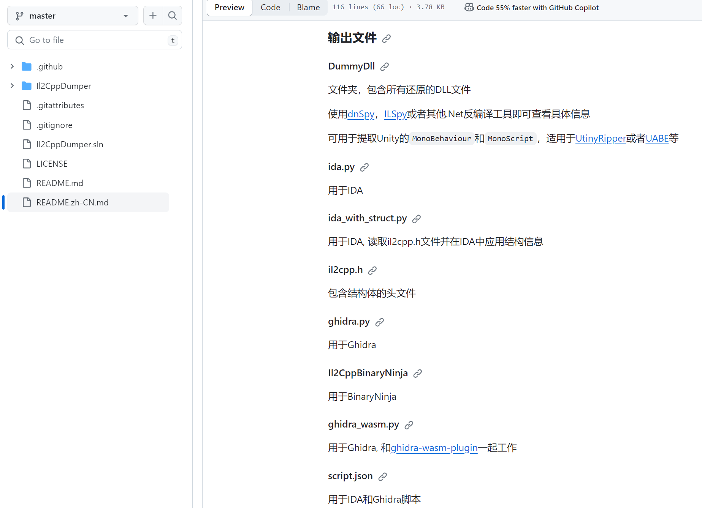

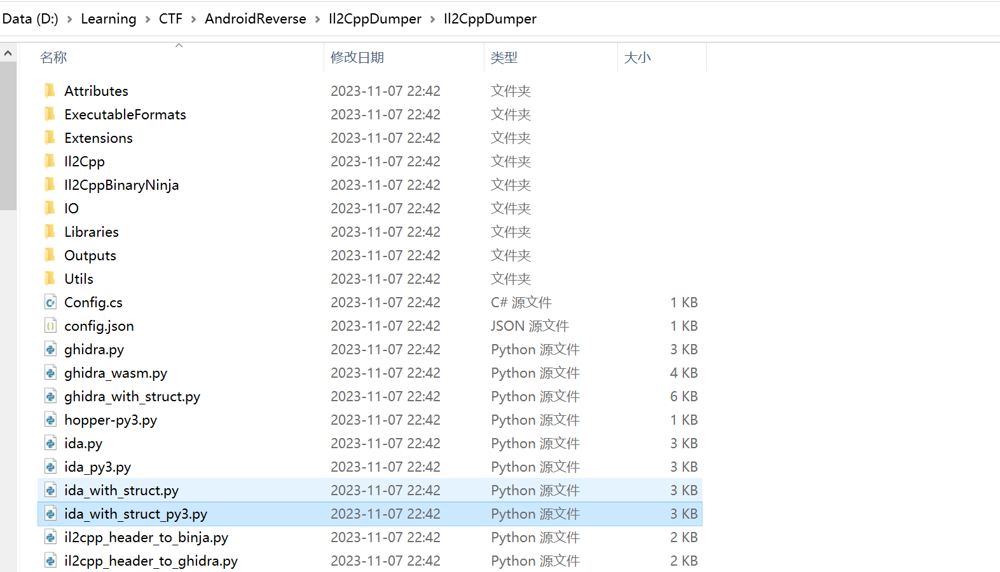

​	最后选择`ida_with_struct_py3.py`脚本：


​	在进行符号转换的文件中搜索“PlayerController”字符串，并在结果中检索与我们需要修改游戏逻辑的几个成员属性和函数。

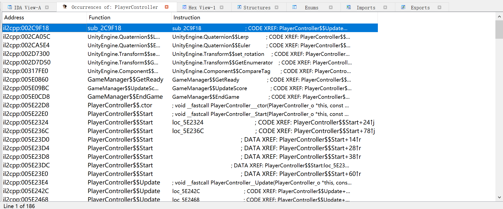

​	下面是更新游戏分数的逻辑。有些`StringLiteral_xxxx`的Tag我没有用脚本进行转化，这里给出部分对应表：

>   在对应表中并没有**Pipe**，只有**Obstacle**，表示障碍物，这里Obstacle应该代指Pipe

```
3004	Start
3005	Point
3006	Score
3007	GameOver	
3008	Hit
3009	StartGame
3010	Swoosh
3011	End
3012	Game
3013	Flap
3014	Obstacle
3015	Ground
```

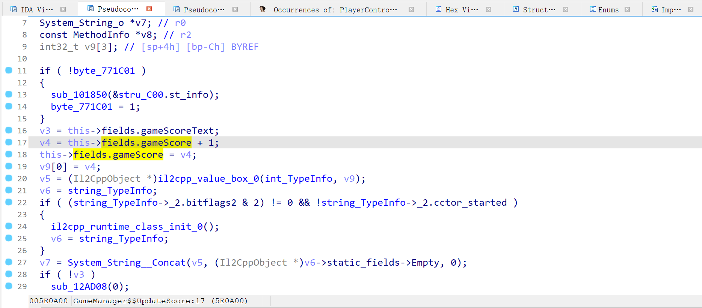

​	下面是`OnTriggerEnter2D`的反编译代码，可以看出是游戏结束时的触发逻辑，在游戏结束时更新分数，最后还会`KillPlayer`！


​	下面是`OnCollisionEnter2D`的反编译代码，可以看出这里主要判断与地面的碰撞


## 3. 实战外挂实现

### 3.1 直接修改so文件

回顾上面找到的3个关键方法函数，只需要用IDA Pro进行一些Patch就可以实现外挂。

*   Patch分数更新逻辑，使得一次跳跃就能加255分！


*   Patch`OnTrigger`碰撞逻辑，使得即使撞到了障碍物也不会跳到`KillPlayer`逻辑，由于两次比较的Tag分别为`GameOver`和`Obstacle`，需要将第二次分支判断Patch掉才能达到无敌的效果。

>   游戏结束也分为成功结束和失败结束，这个方法用一个嵌套的方式编写可能就是为了区分是通关后的GameOver还是碰撞了Obstacle后的GameOver

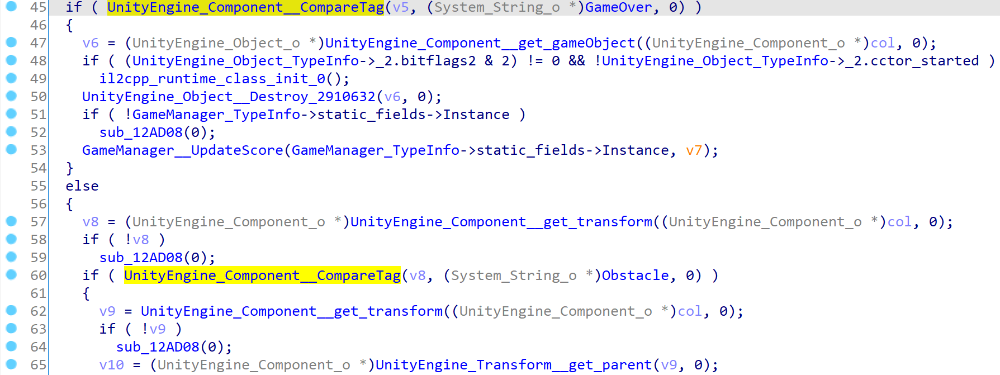

​	下面是第一处判断的逻辑：

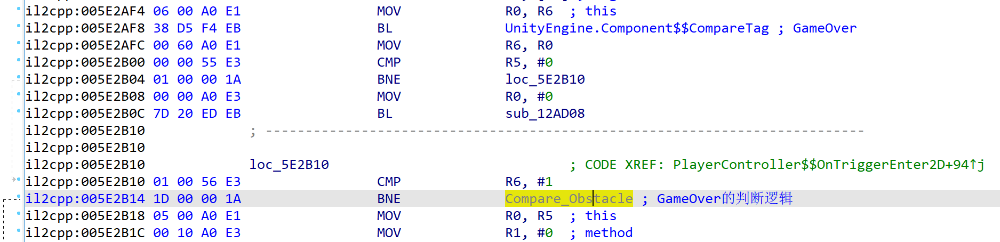

​	第二处判断跳转的程序段在``KillPlayer`之后，这说明应该在这里无条件跳转，使玩家避免死亡，我们将其patch成`B`也就是将操作数机器码改为`EA`


*   同上，对于触碰地面的逻辑也进行了Patch，使小鸟不会死亡。


将修改后的.so文件push到模拟器中，再用MT管理器重新打包。（自动重新签名）


​	效果如下图，小鸟已经无视碰撞事件了，并且每次翻越能加255分。


### 3.2 Frida脚本编写，Hook游戏实现外挂

	

​	将下载好的合适版本的`frida_server` push进模拟器


​	用`frida-ps -U`测试，可以正常运行


​	编写frida插件脚本，修改在`3.1`中的几个地方的内存，即可实现外挂。

*   [0x5E3158]处的shell code


*   [0x5E2BCC]处的shell code


*   [0x5E0A0C]处的shell code


```java
/// 以下脚本可以实现无视碰撞无敌
Java.perform(() => {
    var libil2cpp = Process.findModuleByName("libil2cpp.so");
    // OnTriggerEnter2D
    var offset1 = 0x5E2BCC;
    var addr1 = libil2cpp.base.add(offset1);
    var arr1 = [0xE5, 0x00, 0x00, 0xEA]; // B 0x5E2BCC
    // 修改内存保护
    Memory.protect(addr1, 0x1000, 'rwx');
    Memory.writeByteArray(addr1, arr1);
    // OnCollisionEnter2D
    var offset2 = 0x5E3158;
    var addr2 = libil2cpp.base.add(offset2);
    var arr2 = [0x1A, 0x00, 0x00, 0xEA]; // B 0x5E3158
    // 修改内存保护
    Memory.protect(addr2, 0x1000, 'rwx');
    Memory.writeByteArray(addr2, arr2);
});
```


```Java
/// 以下脚本可以实现额外加分
Java.perform(() => {
    var libil2cpp = Process.findModuleByName("libil2cpp.so");
    // UpdateScore
    var offset1 = 0x5E0A0C;
    var addr1 = libil2cpp.base.add(offset1);
    var arr1 = [0x64, 0x10, 0x81, 0xE2]; // 0x64加100分 0x5E0A0C
    // 修改内存保护
    Memory.protect(addr1, 0x1000, 'rwx');
    Memory.writeByteArray(addr1, arr1);
});
```


下面是连接上frida_server后启动脚本的效果

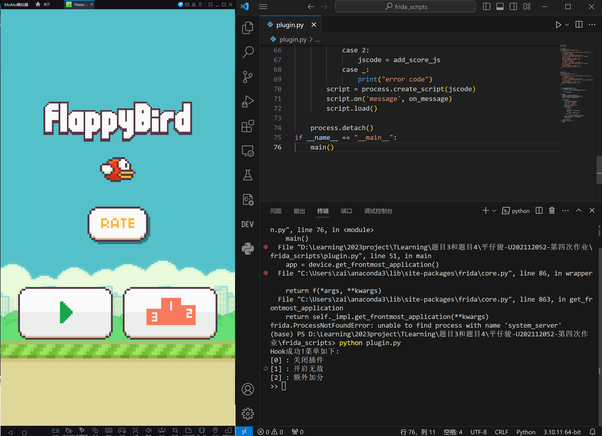

​	开启invincible无法阻挡

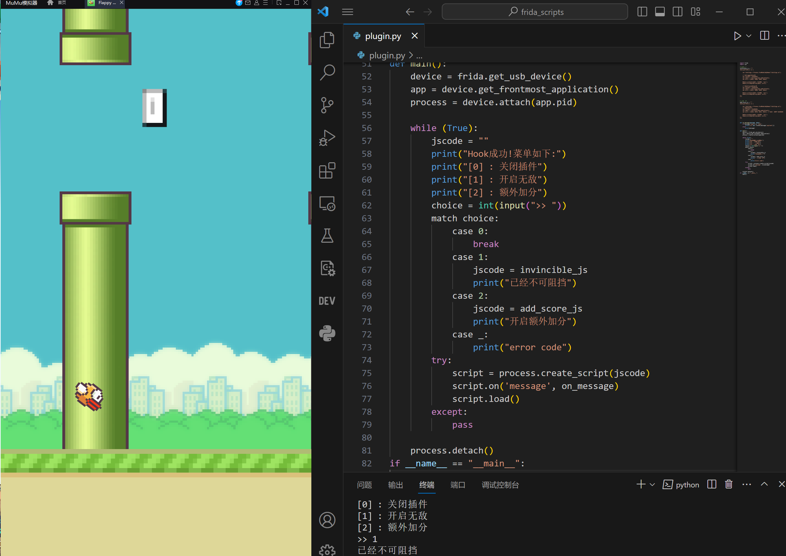

​	开启add_score额外加分

​					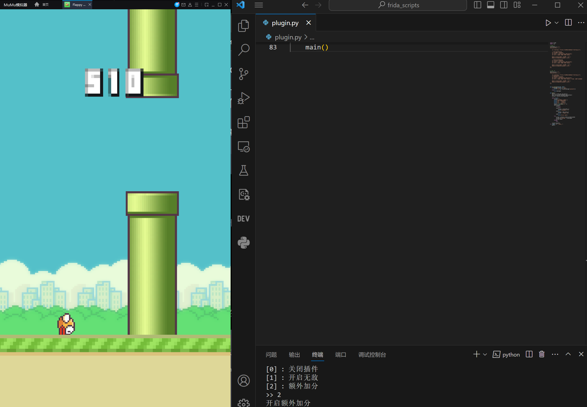